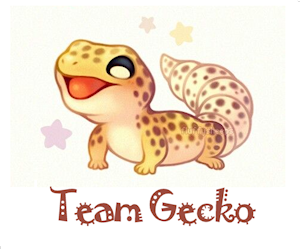

  

# Guess the Language! - A Language Guessing Game | https://guessthelanguage.com
- This project is associated with [Chingu](https://chingu.io/)

# Installation and Setup
## Front End:
1. Clone or download project files in this repository.
2. Change directory: `cd v8-geckos-team-04`
3. Install dependencies: `npm install`
4. Start project: `npm start`
5. Access the application in your web browser using http://localhost:3000

## Back End:
1. Install elixir: https://elixir-lang.org/install.html
2. Install Phoenix:https://hexdocs.pm/phoenix/installation.html
3. Start your Phoenix server:
  * Install dependencies with `mix deps.get`
  * Create and migrate your database with `mix ecto.setup`
  * Install Node.js dependencies with `cd assets && npm install`
  * Start Phoenix endpoint with `mix phx.server`
4. Now you can visit [`localhost:4000`](http://localhost:4000) from your browser.

# Team members
- [Carlos Sisnett](https://github.com/csisnett)
- [Ying Huang](https://github.com/welcomeying)
- [Sabrina Markon](https://github.com/SabrinaMarkon)
- [Susanna Kline](https://github.com/sdk-irl)

# Our Stack
## Front End (Sabrina, Susanna, Ying)
- React, React Hooks
- ReactN (Global State)
- React Router
- Axios
- Bootstrap
- Testing tools: Jest, Enzyme, react-testing-library
- HTML5
- CSS
- Node.js

## Back End (Carlos)
- Elixir
- Phoenix Framework
- Ecto
- Postgresql

# Project management tool
[Trello](https://trello.com)

# Git Branches:
- master: Only updated from PR's from the development branch for release. This branch always reflects the current production release.
- development: Reflects the candidate code for the next release. Developers work in developer branches, which are then pulled into this branch. All code pulled into this branch must be tested and undergo peer review as part of the PR process.
- developer branches: Are individual branches created by each developer when they are working on changes and bug fixes. There are 4 basic types of branches: bug, feature, refactor and style, after the type comes the name, it should specify on top of the branch type. 

# Deployment
- http://guessthelanguage.com
- https://geckos-guess-the-language-game.netlify.com
